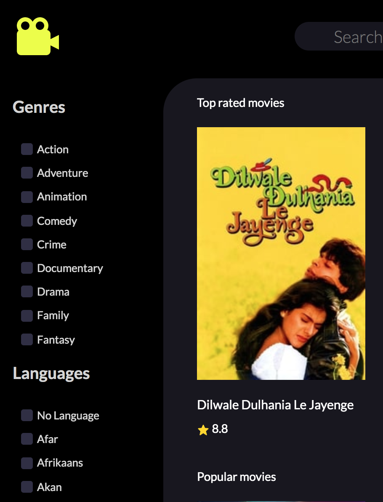
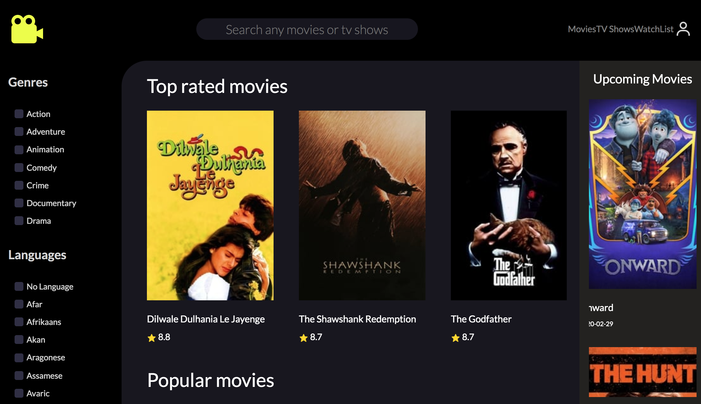
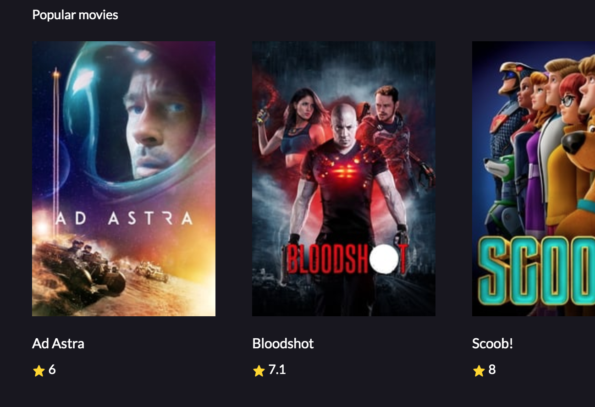
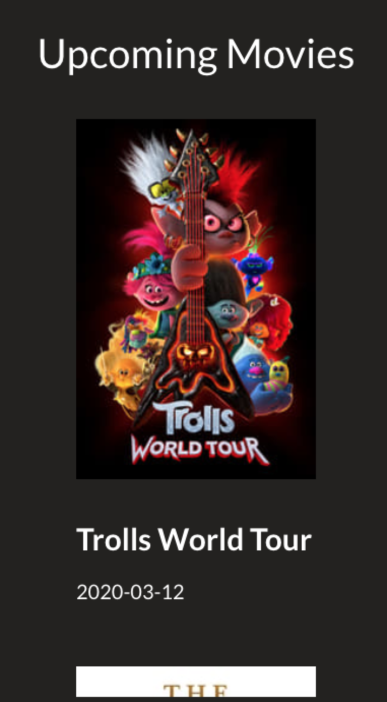
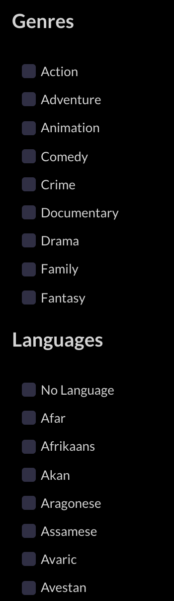
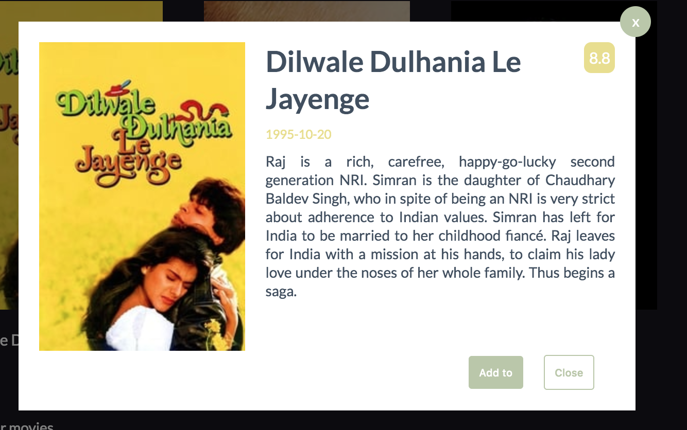
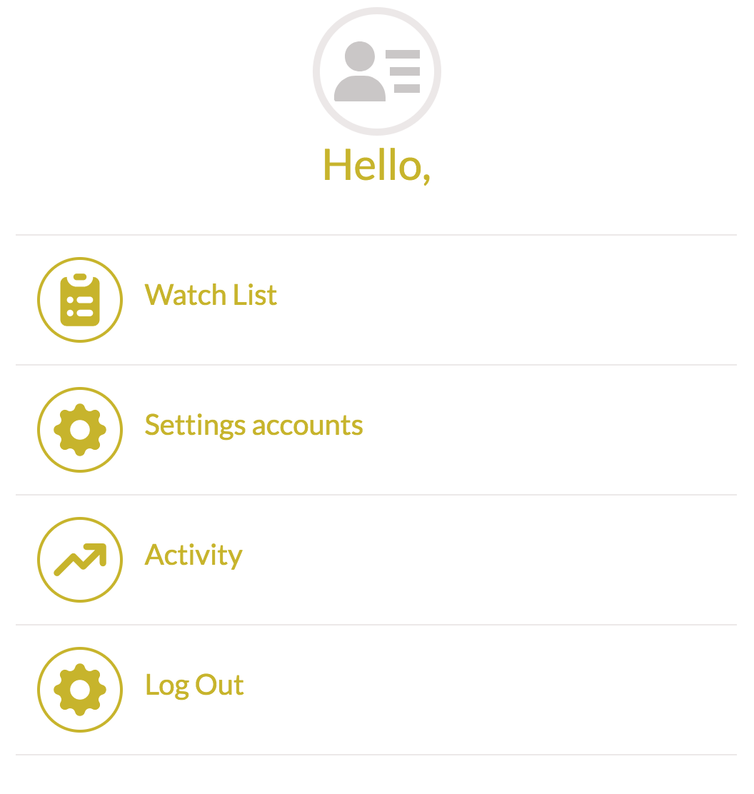

## Installation

Run the application using:

```bash
yarn start
```

## Layout

The page consists of a top bar with navigation. Right and left sidebar.
The right sidebar is responsible for filters, left display upcoming movies. 

Inside there is a list with dynamically downloaded movies.




All components are styled using styled-components.


## Fetching data

I used Fetch in order to get data from API. I used API from The Movie Database (TMDb). 

I used the couple's endpoints of data.
 
For displaying movies on the main page - I use data that represents the most popular and top-rated last week's movies, which can be viewed using the horizontal slider.




Another endpoint is all movies and Tv shows, that the user can search by keyword.


In the right sidebar, I used data that shows upcoming movies.



Subpage called 'TVShows' - the most popular tv shows are shown by default, it is also possible to search for tv shows by keyword in the database with all tv shows.

Similarly, in the case of sub-called 'Movies'


I also fetch data containing movie genres and foreign languages.




## Key Functionality

One of the key features is to search all movies and tv shows by keyword on the main page. 

On the Movies and TV shows subpage, this functionality is also implemented, but you can only search for one type here.

Each movie is clickable and displays a modal with description and the ability to add it to the watch list.



There is also a second type of modal on the page, which allows moving the user to the login page (if he is not logged in yet) or account editing (if he is already logged in) and the watch list.



In the application, I implemented a simple login system using local Storage.
To log in to the application is needed to complete the form that is valid. 


Each subpage uses filters, you can filter movies by genres and languages.


